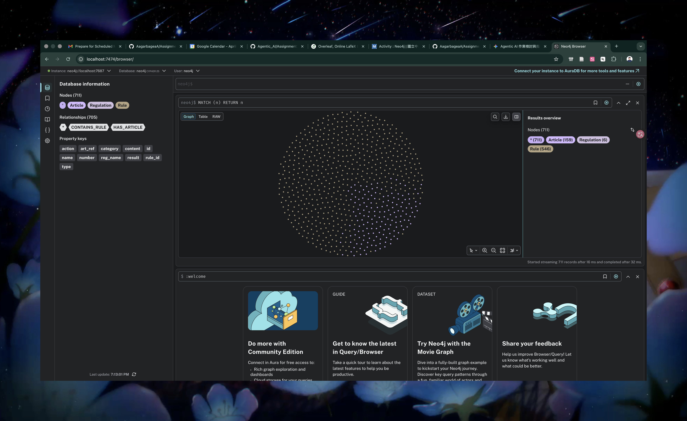
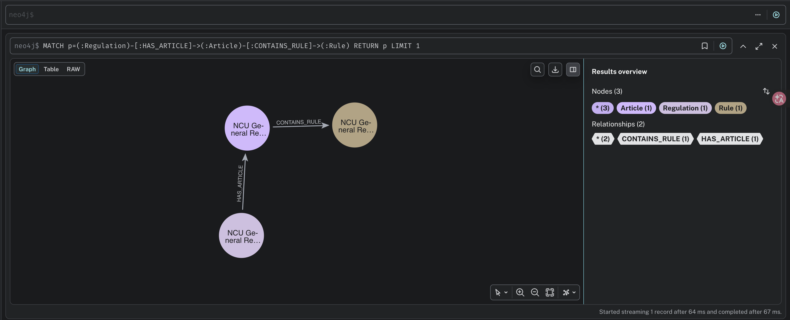

# Assignment 4: KG-based QA for NCU Regulations

**學生：盧建霖**

---

## 📄 Report: System Design & Analysis

### 1. KG construction logic and design choices
為了快速且有效地建立 Knowledge Graph，我選擇了以「句子」為單位的切分策略。

**設計決策：**
- 將長篇的法規 (Article) 透過句點 (`.`) 切分成獨立的句子。
- 每個句子直接對應到一個 Rule 節點的 `action` 屬性，`result` 則統一標示。
- 這樣做不僅能大幅縮短實作與 Knowledge Graph 建置的時間，在後續進行關鍵字檢索時，也能保證比對的完整性，避免因為 LLM 過度濃縮而遺漏重要的法規關鍵字。

### 2. KG schema/diagram
本系統嚴格遵循規定的 Graph Schema：
`(:Regulation)-[:HAS_ARTICLE]->(:Article)-[:CONTAINS_RULE]->(:Rule)`

- **Regulation**: `reg_name`, `category`
- **Article**: `number`, `content`, `reg_name`, `category`
- **Rule**: `rule_id`, `type`, `action`, `result`, `art_ref`, `reg_name`

**系統節點與關聯全貌：**
*(請把你的第一張銀河系圖片命名為 kg_full.png 並放在資料夾中，路徑如下)*


**Schema 關聯特寫圖：**


### 3. Key Cypher query design and retrieval strategy
檢索策略分為兩個階段：

- **雙路徑檢索 (Typed + Broad Strategy)**: Cypher 同時去 Rule 節點與 Article 節點撈取資料。這確保了如果 Rule 切割得太碎導致找不到時，還有完整的 Article 可以作為 Fallback。
- **計分機制 (Scoring)**:
  1. 實作基礎的 Stopwords 過濾，只保留有意義的實體單字。
  2. 針對法規文字比對，將 keywords 與 text 轉換為小寫，並處理基礎的單複數與時態變化（如去 s, ies, ing, ed 等）放寬比對條件。
  3. 計算關鍵字出現的「次數 (count)」進行加分，並導入**「長度懲罰 (Length Penalty)」**機制。將初步分數除以文本長度（`score / ((len(text) ** 0.4) + 1)`），避免字數高達幾百字的總則廢話，靠著字數多贏過短小精準的具體規則 (Rule)，確保檢索排名的精準度。

### 4. Failure analysis + improvements made
在開發與跑 `auto_test.py` 的過程中，我遇到了兩個造成準確率低下的主要問題，並進行了以下優化：

- **Issue 1: 隱藏的 Deduplication Bug (導致大量漏抓)**
  - **分析**: 原本在過濾重複結果時，是用 `rule_id` 當作唯一值 (UID)。但 Article 節點的 `rule_id` 預設是 `N/A`，導致系統誤把所有 Article 當成同一筆資料給過濾掉，造成 LLM 經常回覆 Insufficient rule evidence。
  - **解法**: 修改過濾邏輯。當 `rule_id` 為 `N/A` 時，改用 `art_ref` (條文內容) 的前 100 個字元作為 UID，成功確保 LLM 能拿到充足的 Context。

- **Issue 2: 使用者提問與法規用字的同義詞落差**
  - **分析**: 測試集中的問題用語常常與法規原文不同。例如題目問 `cheating`，法規寫 `misconduct`；問 `working days`，法規寫 `workdays`；問 `bachelor`，法規寫 `undergraduate`。這導致單純的字串比對完全抓不到目標條文。
  - **解法**: 實作了 Query Expansion (查詢擴展)。在 `extract_entities` 階段，攔截特定意圖並主動補上同義詞。例如偵測到 `cheat` 就加入 `misconduct`，偵測到 `late` 就加入 `minutes` 與 `after`。這個優化有效解決了檢索死角，大幅提升了最終的 Query Accuracy。

---

## 🛠️ Prerequisites & Setup (How to run)

Before you begin, ensure you have the following installed:
* Python 3.11 (Strict requirement) 
* Docker Desktop (Required to run the Neo4j database)
* Internet access for first-time HuggingFace model download (local model will be cached)

### 1. Database Setup (Neo4j via Docker)
You must run a local Neo4j instance using Docker. Run the following command in your terminal:
```bash
docker run -d --name neo4j -p 7474:7474 -p 7687:7687 -e NEO4J_AUTH=neo4j/password neo4j:latest
